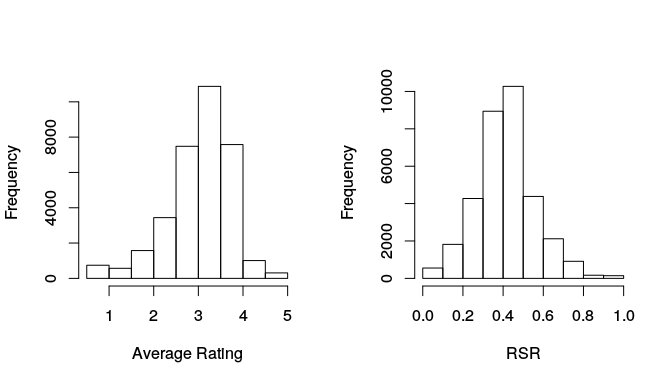
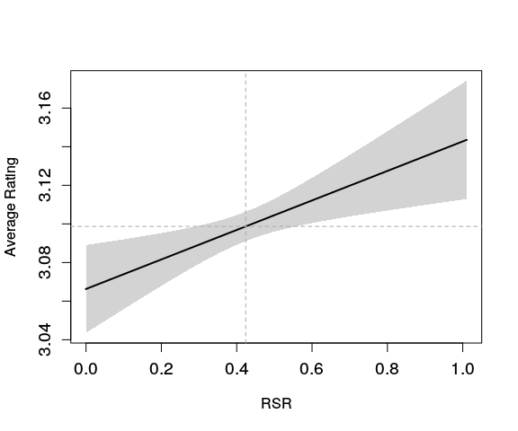
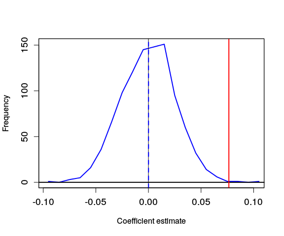

# The QWERTY effect in MovieLens
David Garcia  
February 25, 2016  

## Composing the MovieLens dataset

1.We download the University of Minnesota MovieLens dataset http://grouplens.org/datasets/movielens/


```python
import urllib
import zipfile
urllib.urlretrieve ("http://files.grouplens.org/datasets/movielens/ml-latest.zip", "ml-latest.zip")
with zipfile.ZipFile('ml-latest.zip', "r") as z:
    z.extractall(".")
```

2.We process each movie


```python
# Function to calculate R and L on a text
def RL(str, rchar=["y","u","i","o","p","h","j","k","l","n","m"], lchar=["q","w","e","r","t","a","s","d","f","g","z","x","c","v","b"]):
	rval = 0
	lval = 0

	str = str.lower()
	
	for rc in rchar:
		rval +=	str.count(rc)
	for lc in lchar:
		lval +=	str.count(lc)
	
	return rval, lval

# We load the data into dictionaries
titleDict = dict()
ratingssumDict = dict()
nratingsDict = dict()

fin = open("ml-latest/movies.csv", "rt")
for line in fin:
  fields = line.split(",")
  if fields[0] != "movieId":
    id = fields[0].strip()
    name = fields[1].split("(")[0].strip()
    titleDict[id] = name
fin.close()

fin = open("ml-latest/ratings.csv", "rt")
for line in fin:
  fields = line.split(",")
  if fields[0] != "userId":
    id = fields[1]
    rating = float(fields[2])
    ratingssumDict[id] = ratingssumDict.get(id, 0) + rating  
    nratingsDict[id] = nratingsDict.get(id,0) + 1
fin.close()

#We write the data to a tabulated text file
fout = open("MovieLens-data.txt", "w")
fout.write("R" + "\t" + "L" + "\t" + "avgR" + "\t" + "nR" + "\t" + "name" + "\n"  )

for id in titleDict.keys():
  name = titleDict[id].replace("\"", "'")
  R,L = RL(name)

# number of ratings
  nR = nratingsDict.get(id, 0)
  rSum = ratingssumDict.get(id, -1)
  if nR > 0 and rSum > 0 and (R+L>0) :#We take only valid movie entries
    avgR = rSum/nR
    fout.write(str(R) + "\t" + str(L) + "\t" + str(avgR) + "\t" + str(nR) + "\t\"" + name + "\"\n")

fout.close()

```

3.We compute relevant statistics and save them in a data frame


```r
rm(list=ls())
data <- read.table("MovieLens-data.txt", header=TRUE, sep="\t", quote="\"")

attach(data)
RSR <- R/(L+R) #Calculate Rigth Side Ratio

f <- nR>0 & (R+L)>0 

df <- data.frame(V=avgR[f], nameLen=(R+L)[f], RSR=RSR[f], nR=nR[f])
remove(data)
save(df, file="ML-df.RData")
```


4.Descriptive statistics


```r
nprods <- length(df$V)
nratings <- sum(df$nR)
avgRating <- mean(df$V)
avgRSR <- mean(df$RSR)
dfstats <- data.frame(nprods, nratings, avgRating, avgRSR)
  colnames(dfstats) <- c("Number of movies", "Number of ratings", "Mean average rating", "mean RSR")
  row.names(dfstats) <- "MovieLens"
library(knitr)
kable(x=dfstats, caption="Data summary for MovieLens", digits=10)
```


Table: Data summary for MovieLens

             Number of movies   Number of ratings   Mean average rating    mean RSR
----------  -----------------  ------------------  --------------------  ----------
MovieLens               33574            22821222              3.098708   0.4239799

```r
#histograms of Average Ratings and RSR
par(mfrow=c(1,2))
hist(df$V, main="", xlab="Average Rating", breaks=11)
hist(df$RSR, main="", xlab="RSR", breaks=11)
```



## First test: Do average ratings grow with RSR?

1. We fit an OLS model: $V= a + b * RSR$


```r
suppressMessages(library(texreg)) 
#Philip Leifeld (2013). texreg: Conversion of Statistical Model Output in R to LaTeX and HTML Tables. Journal of Statistical Software, 55(8), 1-24.
linModel <- lm(V ~ RSR, data=df)
htmlreg(linModel, digits=6, bold=0.05, custom.model.names="OLS",caption="OLS results")
```


<!DOCTYPE HTML PUBLIC "-//W3C//DTD HTML 4.01 Transitional//EN" "http://www.w3.org/TR/html4/loose.dtd">
<table cellspacing="0" align="center" style="border: none;">
<caption align="bottom" style="margin-top:0.3em;">OLS results</caption>
<tr>
<th style="text-align: left; border-top: 2px solid black; border-bottom: 1px solid black; padding-right: 12px;"></th>
<th style="text-align: left; border-top: 2px solid black; border-bottom: 1px solid black; padding-right: 12px;"><b>OLS</b></th>
</tr>
<tr>
<td style="padding-right: 12px; border: none;">(Intercept)</td>
<td style="padding-right: 12px; border: none;"><b>3.066295</b><sup style="vertical-align: 0px;">***</sup></td>
</tr>
<tr>
<td style="padding-right: 12px; border: none;"></td>
<td style="padding-right: 12px; border: none;">(0.011628)</td>
</tr>
<tr>
<td style="padding-right: 12px; border: none;">RSR</td>
<td style="padding-right: 12px; border: none;"><b>0.076448</b><sup style="vertical-align: 0px;">**</sup></td>
</tr>
<tr>
<td style="padding-right: 12px; border: none;"></td>
<td style="padding-right: 12px; border: none;">(0.025844)</td>
</tr>
<tr>
<td style="border-top: 1px solid black;">R<sup style="vertical-align: 0px;">2</sup></td>
<td style="border-top: 1px solid black;">0.000261</td>
</tr>
<tr>
<td style="padding-right: 12px; border: none;">Adj. R<sup style="vertical-align: 0px;">2</sup></td>
<td style="padding-right: 12px; border: none;">0.000231</td>
</tr>
<tr>
<td style="padding-right: 12px; border: none;">Num. obs.</td>
<td style="padding-right: 12px; border: none;">33574</td>
</tr>
<tr>
<td style="border-bottom: 2px solid black;">RMSE</td>
<td style="border-bottom: 2px solid black;">0.713238</td>
</tr>
<tr>
<td style="padding-right: 12px; border: none;" colspan="2"><span style="font-size:0.8em"><sup style="vertical-align: 0px;">***</sup>p &lt; 0.001, <sup style="vertical-align: 0px;">**</sup>p &lt; 0.01, <sup style="vertical-align: 0px;">*</sup>p &lt; 0.05</span></td>
</tr>
</table>

2. We explore the model result


```r
w <- 0.01
RSRs <- seq(min(df$RSR), max(df$RSR)+w, by=w) # A series of values in the RSR range

# We generate predictions of average ratings based on RSR values
err <- stats::predict(linModel, newdata=data.frame(RSR=RSRs), interval = "confidence")
mnPred <- err[,1]
upperPred <- err[,3]  #confidence interval of the prediction
lowerPred <- err[,2]

#We plot the predictions with a shaded area around
ylims <- c(min(lowerPred), max(upperPred))
plot(RSRs, mnPred, xlim=range(RSRs), ylim=ylims, lwd=2, type="l", xlab="RSR", ylab="Average Rating", cex.axis=1.2)
polygon(x=c(RSRs, rev(RSRs)), y=c(upperPred, rev(lowerPred)), col="lightgray", lty=0)
lines(RSRs, mnPred, type="l", lwd=2)
abline(v=mean(df$RSR), col="darkgray", lty=2)
abline(h=mean(df$V), col="darkgray", lty=2)
```



## Second test: does the effect disappear after shuffling the data?

1. We shuffle the dataset and fit the same model: $V= a + b * {RSR}_s$


```r
rRSR <- sample(df$RSR, replace=FALSE) # Shuffle the data
rdata <- data.frame(V=df$V, RSR = rRSR)
rmodel <- lm(V ~ RSR, data=rdata)
htmlreg(list(rmodel,linModel),digits=6, bold=0.05, custom.model.names=c("Randomized","OLS"),caption="Randomized and OLS results")
```


<!DOCTYPE HTML PUBLIC "-//W3C//DTD HTML 4.01 Transitional//EN" "http://www.w3.org/TR/html4/loose.dtd">
<table cellspacing="0" align="center" style="border: none;">
<caption align="bottom" style="margin-top:0.3em;">Randomized and OLS results</caption>
<tr>
<th style="text-align: left; border-top: 2px solid black; border-bottom: 1px solid black; padding-right: 12px;"></th>
<th style="text-align: left; border-top: 2px solid black; border-bottom: 1px solid black; padding-right: 12px;"><b>Randomized</b></th>
<th style="text-align: left; border-top: 2px solid black; border-bottom: 1px solid black; padding-right: 12px;"><b>OLS</b></th>
</tr>
<tr>
<td style="padding-right: 12px; border: none;">(Intercept)</td>
<td style="padding-right: 12px; border: none;"><b>3.088214</b><sup style="vertical-align: 0px;">***</sup></td>
<td style="padding-right: 12px; border: none;"><b>3.066295</b><sup style="vertical-align: 0px;">***</sup></td>
</tr>
<tr>
<td style="padding-right: 12px; border: none;"></td>
<td style="padding-right: 12px; border: none;">(0.011630)</td>
<td style="padding-right: 12px; border: none;">(0.011628)</td>
</tr>
<tr>
<td style="padding-right: 12px; border: none;">RSR</td>
<td style="padding-right: 12px; border: none;">0.024751</td>
<td style="padding-right: 12px; border: none;"><b>0.076448</b><sup style="vertical-align: 0px;">**</sup></td>
</tr>
<tr>
<td style="padding-right: 12px; border: none;"></td>
<td style="padding-right: 12px; border: none;">(0.025847)</td>
<td style="padding-right: 12px; border: none;">(0.025844)</td>
</tr>
<tr>
<td style="border-top: 1px solid black;">R<sup style="vertical-align: 0px;">2</sup></td>
<td style="border-top: 1px solid black;">0.000027</td>
<td style="border-top: 1px solid black;">0.000261</td>
</tr>
<tr>
<td style="padding-right: 12px; border: none;">Adj. R<sup style="vertical-align: 0px;">2</sup></td>
<td style="padding-right: 12px; border: none;">-0.000002</td>
<td style="padding-right: 12px; border: none;">0.000231</td>
</tr>
<tr>
<td style="padding-right: 12px; border: none;">Num. obs.</td>
<td style="padding-right: 12px; border: none;">33574</td>
<td style="padding-right: 12px; border: none;">33574</td>
</tr>
<tr>
<td style="border-bottom: 2px solid black;">RMSE</td>
<td style="border-bottom: 2px solid black;">0.713321</td>
<td style="border-bottom: 2px solid black;">0.713238</td>
</tr>
<tr>
<td style="padding-right: 12px; border: none;" colspan="3"><span style="font-size:0.8em"><sup style="vertical-align: 0px;">***</sup>p &lt; 0.001, <sup style="vertical-align: 0px;">**</sup>p &lt; 0.01, <sup style="vertical-align: 0px;">*</sup>p &lt; 0.05</span></td>
</tr>
</table>


2. We repeat it many times and compare with the original model


```r
rests <- NULL
nrep <- 1000
for (i in seq(1,nrep))
{  
  rRSR <- sample(df$RSR) 
  rdata <- data.frame(V=df$V, RSR = rRSR)
  rmodel <- lm(V ~ RSR, data=rdata, model=FALSE)
  rests[i] <- rmodel$coefficients[2]
}
```


```r
h <- hist(rests, plot=F, breaks=20)
suppressMessages(require(Hmisc))
olsEst <- linModel$coefficients[2]
xlims <- range(c(rests, olsEst))
plot(h$mids, h$counts, col="blue", type="l", xlim=xlims, xlab="Coefficient estimate", ylab="Frequency", lwd=2, cex.axis=1.2) 
abline(h=0, lwd=2)
abline(v=0, lty=1, col="black", lwd=1)
abline(v=olsEst, lty=1, col="red", lwd=2)
abline(v=mean(rests), col="blue", lty=2, lwd=2)
box()
```


  
  
## Third test: is this a confound with the number of ratings?

1. We test for a correlation between RSR and the number of ratings

```r
cor.test(df$RSR, df$nR)
```

```
## 
## 	Pearson's product-moment correlation
## 
## data:  df$RSR and df$nR
## t = -0.2316, df = 33572, p-value = 0.8169
## alternative hypothesis: true correlation is not equal to 0
## 95 percent confidence interval:
##  -0.011960508  0.009432837
## sample estimates:
##         cor 
## -0.00126398
```

2. We fit a model including the number of ratings: $V= a + b * RSR + c * nR$


```r
linModel2 <- lm(V ~ nR, data=df)
linModel3 <- lm(V ~ RSR+nR, data=df)
linModel4 <- lm(V ~ RSR*nR, data=df)
htmlreg(list(linModel,linModel2, linModel3, linModel4), digits=6, bold=0.05, custom.model.names=c("Model 1", "Model 2", "Model 3", "Model 4"),caption="Extended model results")
```


<!DOCTYPE HTML PUBLIC "-//W3C//DTD HTML 4.01 Transitional//EN" "http://www.w3.org/TR/html4/loose.dtd">
<table cellspacing="0" align="center" style="border: none;">
<caption align="bottom" style="margin-top:0.3em;">Extended model results</caption>
<tr>
<th style="text-align: left; border-top: 2px solid black; border-bottom: 1px solid black; padding-right: 12px;"></th>
<th style="text-align: left; border-top: 2px solid black; border-bottom: 1px solid black; padding-right: 12px;"><b>Model 1</b></th>
<th style="text-align: left; border-top: 2px solid black; border-bottom: 1px solid black; padding-right: 12px;"><b>Model 2</b></th>
<th style="text-align: left; border-top: 2px solid black; border-bottom: 1px solid black; padding-right: 12px;"><b>Model 3</b></th>
<th style="text-align: left; border-top: 2px solid black; border-bottom: 1px solid black; padding-right: 12px;"><b>Model 4</b></th>
</tr>
<tr>
<td style="padding-right: 12px; border: none;">(Intercept)</td>
<td style="padding-right: 12px; border: none;"><b>3.066295</b><sup style="vertical-align: 0px;">***</sup></td>
<td style="padding-right: 12px; border: none;"><b>3.078787</b><sup style="vertical-align: 0px;">***</sup></td>
<td style="padding-right: 12px; border: none;"><b>3.046043</b><sup style="vertical-align: 0px;">***</sup></td>
<td style="padding-right: 12px; border: none;"><b>3.048592</b><sup style="vertical-align: 0px;">***</sup></td>
</tr>
<tr>
<td style="padding-right: 12px; border: none;"></td>
<td style="padding-right: 12px; border: none;">(0.011628)</td>
<td style="padding-right: 12px; border: none;">(0.003949)</td>
<td style="padding-right: 12px; border: none;">(0.011562)</td>
<td style="padding-right: 12px; border: none;">(0.011807)</td>
</tr>
<tr>
<td style="padding-right: 12px; border: none;">RSR</td>
<td style="padding-right: 12px; border: none;"><b>0.076448</b><sup style="vertical-align: 0px;">**</sup></td>
<td style="padding-right: 12px; border: none;"></td>
<td style="padding-right: 12px; border: none;"><b>0.077223</b><sup style="vertical-align: 0px;">**</sup></td>
<td style="padding-right: 12px; border: none;"><b>0.071057</b><sup style="vertical-align: 0px;">**</sup></td>
</tr>
<tr>
<td style="padding-right: 12px; border: none;"></td>
<td style="padding-right: 12px; border: none;">(0.025844)</td>
<td style="padding-right: 12px; border: none;"></td>
<td style="padding-right: 12px; border: none;">(0.025627)</td>
<td style="padding-right: 12px; border: none;">(0.026273)</td>
</tr>
<tr>
<td style="padding-right: 12px; border: none;">nR</td>
<td style="padding-right: 12px; border: none;"></td>
<td style="padding-right: 12px; border: none;"><b>0.000029</b><sup style="vertical-align: 0px;">***</sup></td>
<td style="padding-right: 12px; border: none;"><b>0.000029</b><sup style="vertical-align: 0px;">***</sup></td>
<td style="padding-right: 12px; border: none;"><b>0.000026</b><sup style="vertical-align: 0px;">***</sup></td>
</tr>
<tr>
<td style="padding-right: 12px; border: none;"></td>
<td style="padding-right: 12px; border: none;"></td>
<td style="padding-right: 12px; border: none;">(0.000001)</td>
<td style="padding-right: 12px; border: none;">(0.000001)</td>
<td style="padding-right: 12px; border: none;">(0.000003)</td>
</tr>
<tr>
<td style="padding-right: 12px; border: none;">RSR:nR</td>
<td style="padding-right: 12px; border: none;"></td>
<td style="padding-right: 12px; border: none;"></td>
<td style="padding-right: 12px; border: none;"></td>
<td style="padding-right: 12px; border: none;">0.000008</td>
</tr>
<tr>
<td style="padding-right: 12px; border: none;"></td>
<td style="padding-right: 12px; border: none;"></td>
<td style="padding-right: 12px; border: none;"></td>
<td style="padding-right: 12px; border: none;"></td>
<td style="padding-right: 12px; border: none;">(0.000008)</td>
</tr>
<tr>
<td style="border-top: 1px solid black;">R<sup style="vertical-align: 0px;">2</sup></td>
<td style="border-top: 1px solid black;">0.000261</td>
<td style="border-top: 1px solid black;">0.016736</td>
<td style="border-top: 1px solid black;">0.017002</td>
<td style="border-top: 1px solid black;">0.017035</td>
</tr>
<tr>
<td style="padding-right: 12px; border: none;">Adj. R<sup style="vertical-align: 0px;">2</sup></td>
<td style="padding-right: 12px; border: none;">0.000231</td>
<td style="padding-right: 12px; border: none;">0.016707</td>
<td style="padding-right: 12px; border: none;">0.016943</td>
<td style="padding-right: 12px; border: none;">0.016947</td>
</tr>
<tr>
<td style="padding-right: 12px; border: none;">Num. obs.</td>
<td style="padding-right: 12px; border: none;">33574</td>
<td style="padding-right: 12px; border: none;">33574</td>
<td style="padding-right: 12px; border: none;">33574</td>
<td style="padding-right: 12px; border: none;">33574</td>
</tr>
<tr>
<td style="border-bottom: 2px solid black;">RMSE</td>
<td style="border-bottom: 2px solid black;">0.713238</td>
<td style="border-bottom: 2px solid black;">0.707336</td>
<td style="border-bottom: 2px solid black;">0.707251</td>
<td style="border-bottom: 2px solid black;">0.707250</td>
</tr>
<tr>
<td style="padding-right: 12px; border: none;" colspan="5"><span style="font-size:0.8em"><sup style="vertical-align: 0px;">***</sup>p &lt; 0.001, <sup style="vertical-align: 0px;">**</sup>p &lt; 0.01, <sup style="vertical-align: 0px;">*</sup>p &lt; 0.05</span></td>
</tr>
</table>

## Fourth test: is this a confound with the number of letters?

1. We test for a correlation between RSR and the number of letters

```r
cor.test(df$RSR, df$nameLen)
```

```
## 
## 	Pearson's product-moment correlation
## 
## data:  df$RSR and df$nameLen
## t = -3.4571, df = 33572, p-value = 0.0005467
## alternative hypothesis: true correlation is not equal to 0
## 95 percent confidence interval:
##  -0.029555138 -0.008169371
## sample estimates:
##         cor 
## -0.01886441
```


2. We fit models including the number of letters:

$V= a + b * RSR + c * nameLen$

and their interaction with RSR: 

$V= a + b * RSR + c * nameLen + d*nameLen*RSR$


```r
linModel2 <- lm(V ~ nameLen, data=df)
linModel3 <- lm(V ~ RSR+nameLen, data=df)
linModel4 <- lm(V ~ RSR*nameLen, data=df)
htmlreg(list(linModel,linModel2,linModel3,linModel4), digits=6, bold=0.05, custom.model.names=c("Model 1", "Model 2", "Model 3", "Model 4"),caption="Extended model results")
```


<!DOCTYPE HTML PUBLIC "-//W3C//DTD HTML 4.01 Transitional//EN" "http://www.w3.org/TR/html4/loose.dtd">
<table cellspacing="0" align="center" style="border: none;">
<caption align="bottom" style="margin-top:0.3em;">Extended model results</caption>
<tr>
<th style="text-align: left; border-top: 2px solid black; border-bottom: 1px solid black; padding-right: 12px;"></th>
<th style="text-align: left; border-top: 2px solid black; border-bottom: 1px solid black; padding-right: 12px;"><b>Model 1</b></th>
<th style="text-align: left; border-top: 2px solid black; border-bottom: 1px solid black; padding-right: 12px;"><b>Model 2</b></th>
<th style="text-align: left; border-top: 2px solid black; border-bottom: 1px solid black; padding-right: 12px;"><b>Model 3</b></th>
<th style="text-align: left; border-top: 2px solid black; border-bottom: 1px solid black; padding-right: 12px;"><b>Model 4</b></th>
</tr>
<tr>
<td style="padding-right: 12px; border: none;">(Intercept)</td>
<td style="padding-right: 12px; border: none;"><b>3.066295</b><sup style="vertical-align: 0px;">***</sup></td>
<td style="padding-right: 12px; border: none;"><b>3.096783</b><sup style="vertical-align: 0px;">***</sup></td>
<td style="padding-right: 12px; border: none;"><b>3.063892</b><sup style="vertical-align: 0px;">***</sup></td>
<td style="padding-right: 12px; border: none;"><b>3.030923</b><sup style="vertical-align: 0px;">***</sup></td>
</tr>
<tr>
<td style="padding-right: 12px; border: none;"></td>
<td style="padding-right: 12px; border: none;">(0.011628)</td>
<td style="padding-right: 12px; border: none;">(0.008351)</td>
<td style="padding-right: 12px; border: none;">(0.013889)</td>
<td style="padding-right: 12px; border: none;">(0.024076)</td>
</tr>
<tr>
<td style="padding-right: 12px; border: none;">RSR</td>
<td style="padding-right: 12px; border: none;"><b>0.076448</b><sup style="vertical-align: 0px;">**</sup></td>
<td style="padding-right: 12px; border: none;"></td>
<td style="padding-right: 12px; border: none;"><b>0.076602</b><sup style="vertical-align: 0px;">**</sup></td>
<td style="padding-right: 12px; border: none;"><b>0.154152</b><sup style="vertical-align: 0px;">**</sup></td>
</tr>
<tr>
<td style="padding-right: 12px; border: none;"></td>
<td style="padding-right: 12px; border: none;">(0.025844)</td>
<td style="padding-right: 12px; border: none;"></td>
<td style="padding-right: 12px; border: none;">(0.025849)</td>
<td style="padding-right: 12px; border: none;">(0.052991)</td>
</tr>
<tr>
<td style="padding-right: 12px; border: none;">nameLen</td>
<td style="padding-right: 12px; border: none;"></td>
<td style="padding-right: 12px; border: none;">0.000143</td>
<td style="padding-right: 12px; border: none;">0.000174</td>
<td style="padding-right: 12px; border: none;">0.003429</td>
</tr>
<tr>
<td style="padding-right: 12px; border: none;"></td>
<td style="padding-right: 12px; border: none;"></td>
<td style="padding-right: 12px; border: none;">(0.000548)</td>
<td style="padding-right: 12px; border: none;">(0.000548)</td>
<td style="padding-right: 12px; border: none;">(0.002018)</td>
</tr>
<tr>
<td style="padding-right: 12px; border: none;">RSR:nameLen</td>
<td style="padding-right: 12px; border: none;"></td>
<td style="padding-right: 12px; border: none;"></td>
<td style="padding-right: 12px; border: none;"></td>
<td style="padding-right: 12px; border: none;">-0.007690</td>
</tr>
<tr>
<td style="padding-right: 12px; border: none;"></td>
<td style="padding-right: 12px; border: none;"></td>
<td style="padding-right: 12px; border: none;"></td>
<td style="padding-right: 12px; border: none;"></td>
<td style="padding-right: 12px; border: none;">(0.004587)</td>
</tr>
<tr>
<td style="border-top: 1px solid black;">R<sup style="vertical-align: 0px;">2</sup></td>
<td style="border-top: 1px solid black;">0.000261</td>
<td style="border-top: 1px solid black;">0.000002</td>
<td style="border-top: 1px solid black;">0.000264</td>
<td style="border-top: 1px solid black;">0.000347</td>
</tr>
<tr>
<td style="padding-right: 12px; border: none;">Adj. R<sup style="vertical-align: 0px;">2</sup></td>
<td style="padding-right: 12px; border: none;">0.000231</td>
<td style="padding-right: 12px; border: none;">-0.000028</td>
<td style="padding-right: 12px; border: none;">0.000204</td>
<td style="padding-right: 12px; border: none;">0.000258</td>
</tr>
<tr>
<td style="padding-right: 12px; border: none;">Num. obs.</td>
<td style="padding-right: 12px; border: none;">33574</td>
<td style="padding-right: 12px; border: none;">33574</td>
<td style="padding-right: 12px; border: none;">33574</td>
<td style="padding-right: 12px; border: none;">33574</td>
</tr>
<tr>
<td style="border-bottom: 2px solid black;">RMSE</td>
<td style="border-bottom: 2px solid black;">0.713238</td>
<td style="border-bottom: 2px solid black;">0.713330</td>
<td style="border-bottom: 2px solid black;">0.713247</td>
<td style="border-bottom: 2px solid black;">0.713228</td>
</tr>
<tr>
<td style="padding-right: 12px; border: none;" colspan="5"><span style="font-size:0.8em"><sup style="vertical-align: 0px;">***</sup>p &lt; 0.001, <sup style="vertical-align: 0px;">**</sup>p &lt; 0.01, <sup style="vertical-align: 0px;">*</sup>p &lt; 0.05</span></td>
</tr>
</table>

Some limitations:

1. We have used OLS linear models for averages (but results hold for permutation tests)
2. Movie ratings and titles can be clustered, for example by director or genre
3. Other controls are needed: Word and letter frequencies, movie year, original language...
